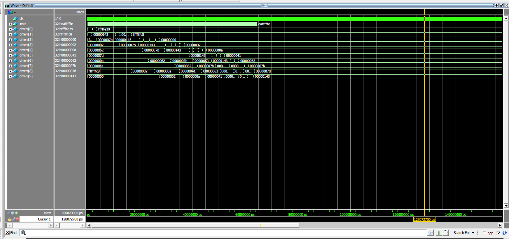

# 🚀 Quad-Threaded ARM ISA-Compatible Processor

-orange.svg)

## 📌 Project Overview
A custom-designed, **5-stage pipelined RISC processor** implemented in Verilog, featuring hardware support for **4-way Simultaneous Multithreading (SMT)**. 

Unlike standard educational processors, this core is heavily optimized to execute complex, compiler-generated C programs (such as Bubble Sort) natively. It features a custom **Micro-operation (Micro-op) Control Engine** to handle multi-cycle CISC-like instructions and a hardware-level **Memory Management Unit (MMU)** to guarantee thread safety during concurrent execution.

---

## 🔥 Engineering Highlights (Why this stands out)
This processor was designed to solve complex architectural hazards and concurrency issues at the hardware level:

### 1. Advanced Micro-op Engine for Block Transfers
Standard RISC pipelines execute one instruction per cycle, making ARM's multi-register load/store (`LDMIA`/`STMIA` like `push {fp, lr}`) notoriously difficult to implement. 
* **The Solution:** Engineered a hardware micro-sequencer state machine inside the Control Unit. It dynamically **freezes the frontend (IF/ID)**, iterates through a 16-bit register mask cycle-by-cycle, and safely resumes the pipeline without ghost states or deadlocks.
* **Base Register Protection:** Implemented intelligent register overriding to cache the Base Register (`Rn`) during multi-cycle execution, preventing data corruption as the pipeline shifts.

### 2. Zero-Overhead Hardware Multithreading (SMT)
* Designed a **Quad-Banked Register File** (4 independent contexts, RF0–RF3) and 4 dedicated Program Counters.
* The hardware round-robin scheduler rotates threads every clock cycle, achieving **zero-overhead context switching**. 
* **Synchronization:** The scheduler dynamically pauses rotation when any thread enters a multi-cycle micro-op state, completely preventing thread-clashing.

### 3. Hardware Memory Partitioning (MMU) & Race Condition Resolution
When 4 threads concurrently execute sorting algorithms on shared memory, race conditions destroy data integrity.
* **The Solution:** Implemented a hardware-level MMU. The CPU utilizes a continuous 16KB SRAM, but the MMU translates virtual addresses into physically isolated 4KB memory banks for each thread. 
* Automatically offsets the Stack Pointer (`SP`) for each thread at hardware reset, ensuring global data arrays and local stack variables never overlap.

---

## 🏗️ Processor Architecture

The 5-Stage Pipeline
1. **IF (Instruction Fetch):** Fetches 32-bit instructions from IMEM based on the dynamically scheduled Thread's PC.
2. **ID (Instruction Decode):** Decodes opcodes, handles immediate generation, and reads from the banked Register File.
3. **EX (Execute):** ALU operations, barrel shifting, and precise branch target evaluation (`Target = PC + 8 + offset`).
4. **MEM (Memory Access):** Load/Store operations with combinational reads for perfect pipeline timing alignment.
5. **WB (Write Back):** Updates the architectural state.

---

## 📜 Supported ISA Subset (ARMv4T)
The processor natively executes 32-bit ARM instructions generated by the GCC compiler:

| Category | Instructions Supported | Hardware Implementation Details |
| :--- | :--- | :--- |
| **Data Processing** | `ADD`, `SUB`, `MOV`, `CMP` | Integrated with a full internal Barrel Shifter. |
| **Memory Access** | `LDR`, `STR` | Single-cycle load/store. |
| **Block Transfer** | `LDMIA`, `STMIA`, `PUSH`, `POP`| Executed via dynamic Micro-op State Machine. |
| **Flow Control** | `B`, `BGE`, `BLE`, `BX` | Fully implemented conditional branching. |

---

## 💻 Hardware/Software Co-Design Workflow
This project validates the full stack, from high-level software to silicon logic:
1. **Compilation:** C source code (e.g., `sort.c`) is compiled using the `arm-none-eabi-gcc` toolchain.
2. **Assembly Analysis:** Validated stack frame generations and memory mapping.
3. **Hex Generation:** Converted binaries into `.hex` files for Verilog `$readmemh`.
4. **Simulation:** Cycle-accurate verification using ModelSim to analyze waveforms and memory dumps.

---

## 📊 Verification & Results

The architecture was rigorously verified using ModelSim. Below are the key validation milestones:

### 1. Successful Concurrent Bubble Sort
Verified through Memory Dumps that all 4 hardware threads can independently and simultaneously sort arrays within their isolated memory banks without data corruption.

 *Caption: Memory dump showing a perfectly sorted array processed by Thread 1 in its isolated physical bank.*

### 2. Micro-op State Machine Execution
 *Caption: The Control Unit intercepting an `LDMIA` instruction, stalling the pipeline, and executing sequential memory accesses.*

### 3. Pipeline Flush & Hazard Handling
 *Caption: Correct pipeline flush execution preventing phantom instructions after a taken branch.*

---

## 🛠️ How to Run / Simulate
1. Clone this repository: `git clone https://github.com/YourUsername/Quad-Thread-ARM-CPU.git`
2. Open ModelSim and set the working directory to the project folder.
3. Compile all Verilog files: `vlog components.v pipelinepc.v tb_pipelinepc.v`
4. Load the simulation: `vsim tb_pipelinepc`
5. Run the simulation for at least `300000 ns` to allow the complex sorting algorithms to complete across all threads: `run 300000ns`
6. Inspect `data_dump.hex` or the ModelSim Memory Viewer to verify the sorted arrays.

---
*Designed by [Ian Chen] - University of Southern California (USC), ECE Dept.*
